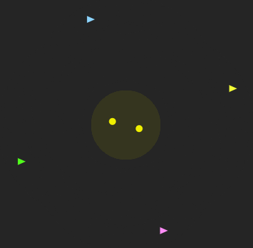
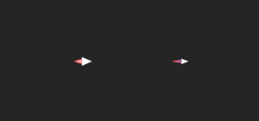

# JS-SPACEWAR:

Welcome to my own version of the game [SPACEWAR](https://en.wikipedia.org/wiki/Spacewar!).

## [**Play Now!**]()

### Controls:
|Player|Thruster|Rotate Left|Rotate Right|Shoot|
|:---:|:---:|:---:|:---:|:---:|
|1|W|A|S|D|
|2|UP|LEFT|RIGHT|DOWN|
|3|T|F|H|G|
|4|I|J|L|K|

## Game Rules:
(All the static values can be easily modified altering the code of the static variables of the source code).
- All objects (ships and bullets) get destroyed when impacting with the end of the solar system or when too close to the stars.
- All objects (except Normal Bullets) suffer the gravitational attraction of the stars.
- Each player have it's own stats and configuration.
- There's a delay in the shoot of each bullet.
- Each player can have 3 bullets on the field at the same time.
- A bullet can destroy another bullet.
- A bullet can destroy a ship.
- If a ship is destroyed, it will respawn in a few seconds.
- A bullet will automatically destroy itself after some time.
- The score works as follows:
  - If a player kills 3 other players in a row, it enters a kill streak.
  - Each kill gives 10 points or 30 if on a kill streak.
  - If a player dies, it loses it's killing streak.
- The accuracy of the player is calculated as follows:
  - Accuracy = (Number of hits / Number of shots) * 100
  - A hit is defined when a bullet isn't destroyed by the stars or the border of the system.

## Description:
This is a same device multiplayer with capacity for up to 4 players. The objective of the game is to destroy the rest of the players while orbiting the binary solar system.

Each player controls a ship with the capacity to shoot 2 types of bullets:
- Fast Bullets: Bullets that travel fast but suffer from the gravity of the stars.
- Normal Bullets: Slower bullets that travel in a straight line.

Each player can also customize their nickname and color (both the ship and it's bullets) using the initial menu.

## Special thanks:

- *CSS animations tutorial*: Using Multi-Step Animations and Transitions: https://css-tricks.com/using-multi-step-animations-transitions/

- 
Flame made by <a href="https://www.flaticon.com/authors/vectors-market" title="Vectors Market">Vectors Market</a> from <a href="https://www.flaticon.com/" title="Flaticon">www.flaticon.com</a>
